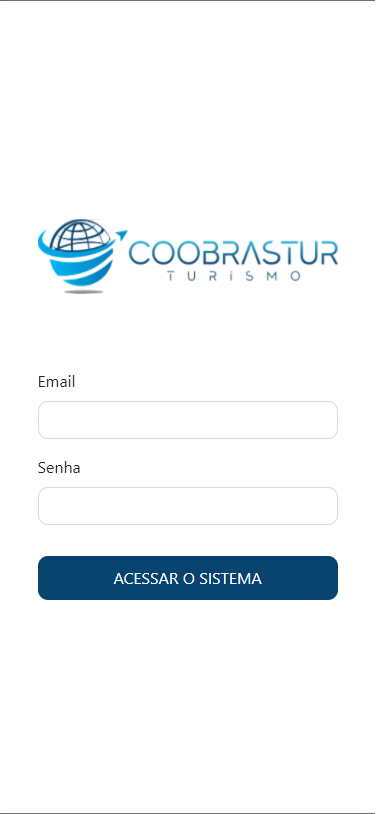
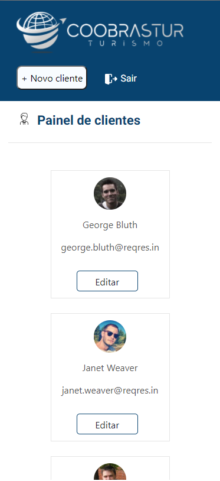
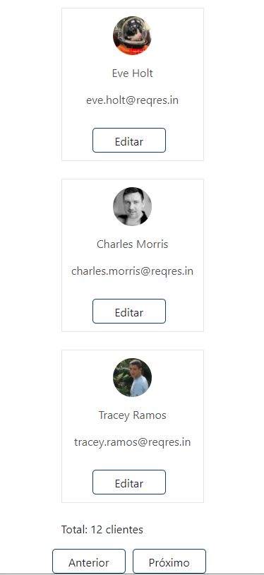
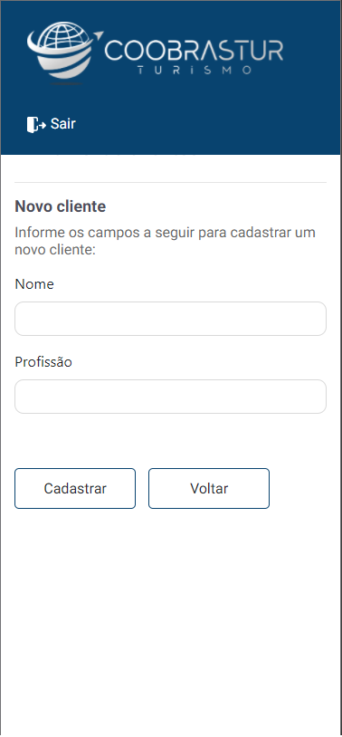
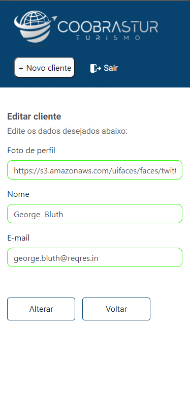

# Coobrastur-test

## Description

The objective of the project is to develop an application with 3 screens, one of which is a login, home screen that shows a list of users and a registration screen. Following the layout provided by the company.

## Preview
*Mobile*
<ul style="display:inline; list-style: none;">
  <li> </li>
  <li> </li>
  <li> </li>
  <li> </li>
  <li> </li>
</ul>

## Technologies Used

- This project was generated with [Angular CLI](https://github.com/angular/angular-cli) version 10.2.0.

- Bootstrap used as CSS library.

- NPM (Node Package Management).

- GIT as versioning controller.

- Used the concept of Mobile First (for responsiveness). 

## Firt step Install dependencies

Run `npm install` for install al dependencies of project.

## Second step Development server

Run `ng serve` for a dev server. Navigate to `http://localhost:4200/`. The app will automatically reload if you change any of the source files.

## Further help

To get more help on the Angular CLI use `ng help` or go check out the [Angular CLI README](https://github.com/angular/angular-cli/blob/master/README.md).
